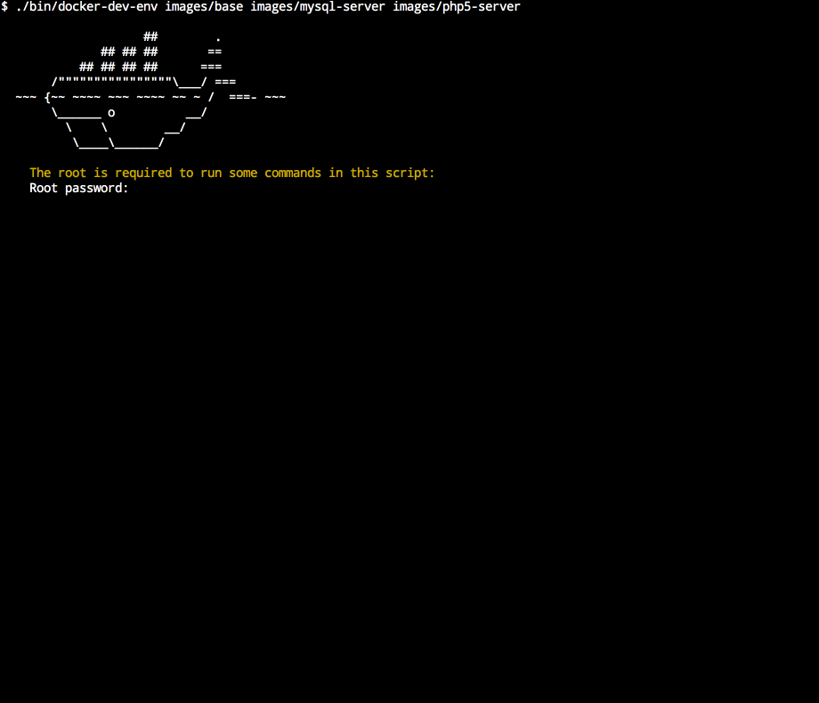

# docker-dev-env

This shell script is intended to simplify creation of a development environments in the Docker especially on the Mac OS. This script does not do much on the Linux but is compatible because this is just convenient for me to use the same script on both OSes as long as I work on both OSes.

## What this script does?

* Configures the Dnsmasq to resolve containers hostnames on a host OS and containers (if the Dnsmasq is installed on a container).
* Adds containers hostnames to the /etc/hosts file in all running containers.
* Mac OS: Configures a network bridge in the VirtualBox and adds gateway route on the host OS to expose containers IPs (172.\*) for the host OS.
* Mac OS: [Configures shared folders using a NFS protocol](https://github.com/adlogix/docker-machine-nfs) (works faster than the default vboxsf)



## How to use?

To create new development environment you need to create the `DevEnvFile` file with configuration of your container. If you create the `Dockerfile` in the same folder as your `DevEnvFile` it will be built automatically.

The `DevEnvFile` is regular shell script with at least two variables:
* `NAME` - The name is used as an image name (if you create the `Dockerfile`), an container name, and a hostname. The hostname is suffixed with ".loc". You can change this suffix using script's options.
* `ARGS` - Arguments for the Docker's run command. You can provide special argument `--build-only` to prevent an image from run. It can be useful if you use some images as templates.
* `IMAGE` - (optional) An image used for build a container. By default value from a `$NAME` variable is used.


The simple `DevEnvFile` file could look like this:
```bash
#!/bin/bash

NAME="example-php5"
ARGS="-tdi -v $MOUNT_DIR/www:/var/www/html"
```

Note that all volumes should me mounted under the `$MOUNT_DIR` directory.

To start your machines you need to run the `./bin/docker-dev-env` script and provide paths to directories containing the `Dockerfile` file and the `DevEnvFile` file as arguments. For example:

`./bin/docker-dev-env images/example-php5 images/example-mysql`

Now, an `example-php5` and an `example-mysql` containers will be accessible through an `example-php5.loc` and an `example-mysql.loc` domains. Because domains are configured by the Dnsmasq service you can also use subdomains (e.g. `www.website.php5-server.loc`). Subdomains will be also supported on your containers if you install the Dnsmasq service on them. Without the Dnsmasq service only hostnames in the /etc/hosts file will be configured on containers.

## Options

```sh
Usage: ./docker-dev-env [OPTIONS] [DIRECTORIES...]

Options:

-h, --help                      Print help message.
-v, --verbose                   Run with a lot of debugging output.
-m, --mount-dir <dir>           The directory where a NFS shared folder will be mount.
-H, --hostname-suffix <suffix>  The suffix appended to hostnames. Default ".loc".
--skip-setup-vbox-net           Skip the VirtualBox bridged network configuration.
--skip-setup-vbox-nfs-sharing   Skip the VirtualBox NFS configuration.
--skip-setup-containers-host    Skip the /etc/hosts file configurstion on containers.
--skip-setup-containers-dnsmasq Skip the Dnsmasq configuration on containers.
--skip-setup-host-dnsmasq       Skip the Dnsmasq configuration on host OS.
```

## Requirements

* [Docker](https://www.docker.com/)
* [Dnsmasq](http://www.thekelleys.org.uk/dnsmasq/doc.html) (on a Mac OS currently supports only version installed from a Macports)

For Mac OS only:
* [Docker Machine](https://docs.docker.com/machine/) 0.5.0+
* [docker-machine-nfs](https://github.com/adlogix/docker-machine-nfs)
