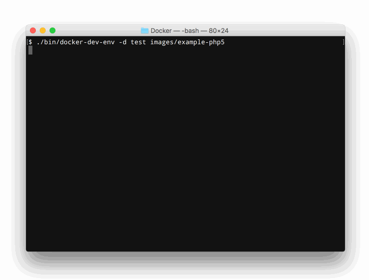

# docker-dev-env

This shell script is intended to simplify creation of a development environments in the Docker especially on the Mac OS. This script does not do much on the Linux but is compatible because this is just convenient for me to use the same script on both OSes.

## What this script does?

* Configures the Dnsmasq to resolve containers hostnames.
* Adds containers hostnames to the /etc/hosts file in all running containers.
* Mac OS: Configures a network bridge in the VirtualBox and adds a gateway route on the host OS to expose containers IPs (172.\*) for the host OS.
* Mac OS: Configures shared folders using NFS protocol (works a lot faster than the default vboxsf)



## How to use?

To create new development environment you need to create a `DevEnvConf` file with configuration for your container. The `DevEnvConf` is regular shell script with few variables:
* `NAME` - The name for your container.
* `ARGS` - Arguments for the Docker's run command. You can provide the special argument `--build-only` to prevent an image from run. It can be useful if you use some images as templates.
* `IMAGE` - (optional) An image used to build a container. By default value from the `$NAME` variable is used.
* `HOSTNAME` - (optional) Container host name. By default value from the `$NAME` variable is used.


If you create the `Dockerfile` file in the same folder as your `DevEnvConf`, an image will be built automatically. The name of the image will be the same as the name of the container.

The simple `DevEnvConf` file could look like this:
```bash
#!/bin/bash

NAME="example-php5"
ARGS="-tdi -v $MOUNT_DIR/www:/var/www/html"
HOSTNAME="example-php5.loc"
```

Note that all volumes should me mounted under the `$MOUNT_DIR` directory!

To start your machines you need to run the `./bin/docker-dev-env` script and provide paths to directories containing the `DevEnvCOnf` file. For example:

`./bin/docker-dev-env images/example-php5 images/example-mysql`

Now, the `example-php5` container will be accessible through the `example-php5.loc` domain.

## Options

```sh
Usage: ./docker-dev-env [OPTIONS] [DIRECTORIES...]

Options:

-h, --help                         Print help message.
-v, --verbose                      Run with a lot of debugging output.
-m, --mount-dir <dir>              The directory where a NFS folder will be mount.
-H, --hostname-suffix <suffix>     The suffix appended to hostnames. Default value: ".loc".
-d, --docker-machine <name>        Name of the Docker Machine. Default value: "default"
--dev-env-only <flag>              Prevents any actions on containers not created by this script. Enabled by default.
--setup-vbox-net <flag>            Configure the VirtualBox bridged network. Enabled by default.
--setup-vbox-nfs-sharing <flag>    Configure the VirtualBox NFS. Enabled by default.
--setup-containers-host <flag>     Configure the /etc/hosts file configuration on containers. Enabled by default.
--setup-containers-dnsmasq <flag>  Configure the Dnsmasq on containers. Disabled by default .
--setup-hosts <flag>               Configure the /etc/hosts file configuration on the host OS. Disabled by default.
--setup-dnsmasq <flag>             Configure the Dnsmasq on the host OS. Enabled by default.

<flag> - 0 or 1.
```

## Requirements

* [Docker](https://www.docker.com/)

For the Mac OS:
* [Docker Machine](https://docs.docker.com/machine/) 0.5.0+
